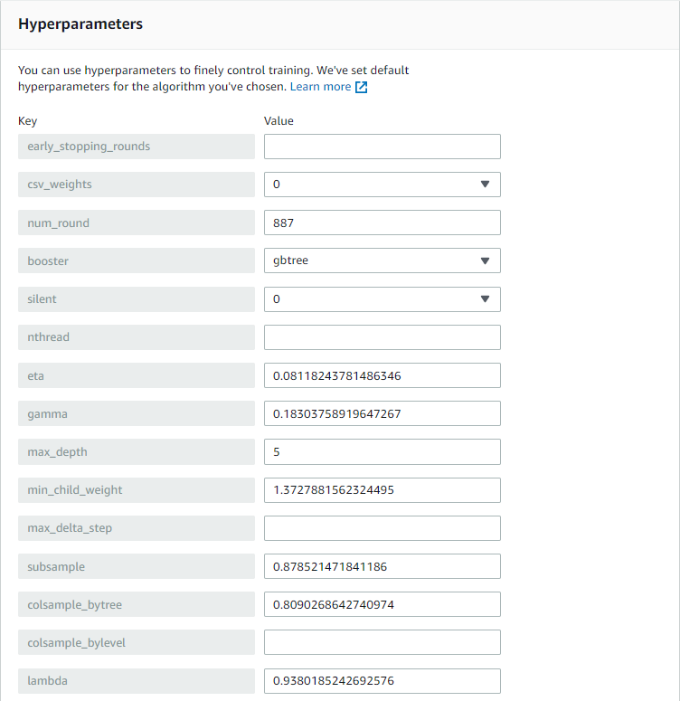
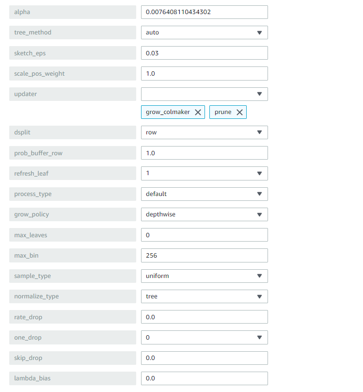
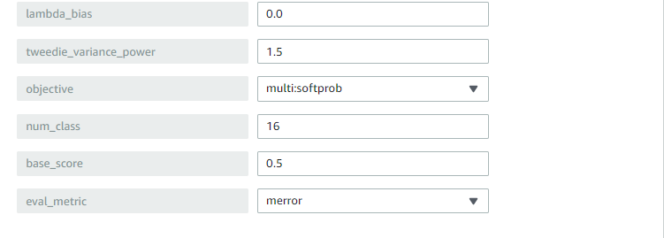

# PoseMate

## Requirements

Install the following dependancies:
- boto3
- mediapipe
- numpy
- opencv-python
- pandas
- pickle-mixin
- playsound
- xgboost==0.90

## What it is

PoseMate is an application that converts American Sign Language (ASL) into voice. There are many different implementations of sign language translation using ML & AI. However, PoseMate is the first solution that accurately classifies dynamic signs/gestures in realtime.

## How it works

PoseMate utilizes [Mediapipe](https://google.github.io/mediapipe/solutions/hands#python-solution-api) for the core hand tracking. The output from the hand tracking is processed and fed into a ML model trained on **Amazon Sagemaker** using the XGBoost Algorithm.

## How to test

`run.py`

This script runs on the following models:
`xgboost-model-dynamic-words-8-tuned`, this has been trained for 8 labels
`xgboost-model-dynamic-words-16-tuned`, this has been trained for 16 labels

Comment or uncomment the labels in the script according to the model that you chose.

`run_v2.py`

This script runs two different models seperately on each hand. Models: 
`xgboost-model-dynamic-words-16-tuned-right`
`xgboost-model-dynamic-words-16-tuned-left`

In our testing, this script performs better.

`runAlphabet.py`

This script classifies all the alphabets and runs the following model:
`xgboost-model-alphabets-24`

`speak.py`

This script is used to handle the output audio.

## Gather Data

`data.py`

Use this script to gather your own data.
Be sure to change `file_name` as you gather data.

After gathering the data, add the label indices before the first column representing each label in your data.
For example:

> 0.123, 0.234, 0.456, ... 
> 0.345, 0.356, 0.345, ... 
> 0.123, 0.234, 0.456, ... 

If these rows represent the first label in your data, add a 0.

> 0, 0.123, 0.234, 0.456, ... 
> 0, 0.345, 0.356, 0.345, ... 
> 0, 0.123, 0.234, 0.456, ... 

After labelling the data, combine them all into a single .csv file.
Split the data into a train/test split at a 80/20 ratio.

## Train a Model

- Upload the `train.csv` and `test.csv` into an **Amazon S3** bucket.
- In the **Amazon Sagemaker** console, create a new training job.
- Select the **XGBoost** algorithm.
- In the **Input Data Configuration** block, under the **train** channel, set:
    - Input mode to **File**
    - Content type to **csv**
    - Compression type to **None**
    - Record wrapper to **None**
    - Data source to **S3**
    - S3 data type to **S3Prefix**
    - S3 data distribution type to **FullyReplicated**
    - S3 location to **location of your train.csv**
- Add another channel in the **Input Data Configuration** block, name it to **validation**.
- Set the same values except the S3 location should point to the **test.csv** file.
- In the **Output Data Configuration** block, set the S3 output path.

### Hyperparameters

The algorithm provides default hyperparameters however, some parameters need to be set according to the dataset.

*num_class* = Set this to the total labels in your dataset
*objective* = Set this to **multi:softprob**
*eval_metric* = Set this to **merror**

To get the best results, use the Hyperparameter tuning jobs to set the remaining parameters.

The following are the best hyperparameters of a hyperparameter tuning job used to create the `xgboost-model-dynamic-words-16-tuned` model.

